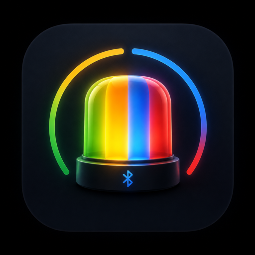

<div align="center">
  

  # CodeLight

  **让 AI 编程 Agent 的状态真正亮起来。**<br>
  **See what your AI coding agents need — at a glance.**

  将 Claude、Codex 等 AI 编程工具的任务状态同步到实体蓝牙灯和桌面通知。<br>
  Sync Claude, Codex, and other coding-agent events to physical BLE lights and desktop notifications.

  [简体中文](#简体中文) · [English](#english)
</div>


---

## 简体中文

### CodeLight 是什么？

CodeLight 是一个面向 AI 编程工作流的 macOS / Windows 桌面应用。它把 Claude、Codex、OpenCode 等工具的“任务完成、需要人工处理、网络重试、最终故障”转换成直观的实体灯光和系统通知，让你不必反复切换窗口查看任务是否需要处理。

项目目前针对 **JTX-RGB / Colorful Lights** 拾音跑马灯完成了实机 BLE 协议适配。连接由电脑直接维护，日常使用不需要保持手机 App 开启，也不依赖云端服务。

### 灯光协议

| 颜色 | 状态 | 默认行为 |
|---|---|---|
| 🟢 绿色 | 任务或当前回合完成 | 快速闪烁后常亮 60 秒 |
| 🟡 黄色 | 任一 Agent 网络重试，需要检查或切换网络 | 快速闪烁后常亮，网络恢复后熄灭 |
| 🔵 蓝色 | 等待回答、选择、审批、授权或补充信息 | 快速闪烁后常亮，处理后熄灭 |
| 🔴 红色 | 最终任务、模型/API、认证或额度故障 | 快速闪烁后常亮，恢复后熄灭 |
| ⚫ 熄灭 | 正在正常执行，或没有待处理事件 | 保持熄灭 |

- 默认亮灯时间为 60 秒，可选择 10 秒、30 秒、2 分钟、5 分钟或一直亮到手动处理。
- 新事件会立即打断当前灯光并重新计时。
- 多个事件竞争同一盏灯时，优先级为：**红 > 黄 > 蓝 > 绿**；同级事件显示最新一条。
- 每盏灯拥有独立的状态队列和计时器，多设备之间互不影响。

### 核心功能

- **实体 BLE 状态灯**：macOS 使用原生 CoreBluetooth 后台服务；Windows 使用 Electron Web Bluetooth。
- **桌面通知联动**：状态变化时同步发送系统通知，通知包含工具和项目名称；点击可打开对应软件。
- **多灯独立绑定**：可同时管理多盏 JTX-RGB，为设备自动编号、设置别名，并分别绑定不同 Provider。
- **可扩展 Provider 架构**：Provider 的名称、图标、软件路径、首页置顶和灯光绑定都可在设置中维护。
- **Agent 额度看板**：显示 Codex 主额度 / Spark 额度，以及 Claude 5 小时、每周和 Fable 5 等实时额度。
- **完整事件记录**：即使新事件打断了旧灯光，历史状态仍可在应用内查看。
- **充电动画隐藏**：默认抑制设备固件的四格充电闪烁，需要时可临时显示 10 秒查看电量。
- **本地优先**：BLE 控制、Hook 事件和状态聚合均在本机运行。
- **后台常驻**：支持登录启动和托盘运行，关闭主窗口不会中断状态监听。

### Provider 预设

CodeLight 内置以下工具的 Provider 配置和品牌图标：

`Claude` · `Codex` · `OpenCode` · `MiMo Code` · `Zed Code` · `Hermes` · `Kilo Code / KCode` · `Gemini CLI` · `Amp` · `Cursor` · `Cline` · `Roo Code` · `Aider` · `Goose` · `Continue` · `Qwen Code` · `Trae` · `Windsurf` · `GitHub Copilot` · `Kiro` · `Kimi` · `OpenHands` · `Antigravity` · `Crush` · `Pi`

你也可以直接在设置中添加自定义 Provider，无需修改状态机核心代码。不同工具的自动事件接入由对应 Hook / Adapter 提供；Claude、Codex 和 OpenCode 已包含本地接入实现。

### 多设备工作方式

```text
Claude ────→ 跑马灯 A（工作台左侧）
Codex  ────→ 跑马灯 B（工作台右侧）
OpenCode ──→ 跑马灯 C（共享设备）
              └─ 独立优先级、灯光和倒计时
```

首页会根据设备数量自适应展示 1–8 张设备卡片；更多设备进入完整管理页面。设备可以使用蓝牙标识生成稳定编号，也可以设置更容易识别的自定义名称。

### 快速开始

#### 环境要求

- macOS 或 Windows 10/11
- Node.js 22
- macOS 本地开发需要 Xcode Command Line Tools / Swift 编译器
- 一盏已上电并处于附近的 JTX-RGB / Colorful Lights 设备

#### 从源码运行

```bash
git clone https://github.com/wqytommy666/CodeLight.git
cd CodeLight

# 仅 macOS：编译原生 CoreBluetooth 后台服务
./build_daemon.sh

cd desktop-app
npm ci
npm run check
npm start
```

首次打开时，请允许 **蓝牙** 和 **通知** 权限。进入“设备”页面后可直接扫描附近蓝牙灯并点击连接；未连接或意外掉线时，CodeLight 会弹窗提醒。

#### 命令行控制（macOS）

```bash
./run.sh scan 15
./light.sh green
./light.sh yellow
./light.sh blue
./light.sh red
./light.sh test
./light.sh off
```

### 构建与测试

```bash
# 后台控制器测试
python3 -m unittest discover -s tests -v

# 桌面端检查与测试
cd desktop-app
npm run check

# macOS DMG + ZIP
../build_daemon.sh ../.build/agent-light-daemon
npm run build:mac

# Windows 安装版 + 便携版（请在 Windows 环境运行）
npm run build:win
```

构建产物保存在 `desktop-app/dist/`。

### 硬件与协议

当前经过实机验证的设备是广播名为 `JTX-RGB`、由 **Colorful Lights** App 控制的跑马灯。CodeLight 通过 BLE `FFF0` 服务及可写 `FFF3` 特征发送控制帧。其他外观相似的灯可能采用不同协议，接入前需要先确认服务、特征和数据帧。

- [BLE 协议调查](PROTOCOL.md)
- [固件与充电动画说明](FIRMWARE.md)
- [桌面端开发说明](desktop-app/README.md)

### 隐私

CodeLight 不需要 CodeLight 云端账户。设备连接信息、Provider 设置、事件记录和额度缓存保存在本机。Claude / Codex 的额度查询复用本机已登录会话，凭据只在桌面端主进程内存中短暂使用，不会发送到渲染页面或写入日志。

---

## English

### What is CodeLight?

CodeLight is a macOS and Windows companion for AI-assisted development. It turns events from Claude, Codex, OpenCode, and other coding tools — task completed, human action required, network retry, or terminal failure — into clear physical light signals and native desktop notifications.

The current hardware integration is built and tested for the **JTX-RGB / Colorful Lights** sound-reactive light bar. Your computer maintains the BLE connection directly, so the mobile app does not need to stay open and no CodeLight cloud service is required.

### Light protocol

| Color | Meaning | Default behavior |
|---|---|---|
| 🟢 Green | Task or turn completed | Flash six times, then stay on for 60 seconds |
| 🟡 Yellow | An agent is retrying the network; check or switch networks | Flash, stay on, and turn off after recovery |
| 🔵 Blue | Answer, choice, approval, permission, or more information required | Flash, stay on, and turn off after handling |
| 🔴 Red | Final task, model/API, authentication, quota, or fatal failure | Flash, stay on, and turn off after recovery |
| ⚫ Off | Work is progressing normally, or nothing needs attention | Remain off |

- The default display time is 60 seconds. It can be changed to 10 seconds, 30 seconds, 2 minutes, 5 minutes, or “until handled.”
- A new event immediately interrupts the current signal and restarts its timer.
- Events competing for one device use this priority: **red > yellow > blue > green**. The newest event wins within the same priority.
- Every physical light has its own event queue and timer, so multiple devices operate independently.

### Highlights

- **Physical BLE status lights** — native CoreBluetooth background service on macOS and Electron Web Bluetooth on Windows.
- **Synchronized desktop notifications** — notifications identify the tool and project; clicking one opens the configured application.
- **Independent multi-device routing** — manage several JTX-RGB lights, assign stable numbers or aliases, and bind each one to a Provider.
- **Extensible Provider architecture** — edit names, icons, application paths, dashboard pins, and device bindings from Settings.
- **Usage dashboards** — Codex primary / Spark limits plus Claude 5-hour, weekly, and Fable 5 quotas.
- **Persistent event history** — interrupted signals remain available in the app's event log.
- **Charging-animation suppression** — hides the firmware's four-bar charging animation by default, with a temporary 10-second battery view.
- **Local-first operation** — BLE control, hooks, and state aggregation run on your computer.
- **Tray and login startup** — monitoring continues when the main window is hidden.

### Provider presets

CodeLight ships with Provider metadata and brand assets for:

`Claude` · `Codex` · `OpenCode` · `MiMo Code` · `Zed Code` · `Hermes` · `Kilo Code / KCode` · `Gemini CLI` · `Amp` · `Cursor` · `Cline` · `Roo Code` · `Aider` · `Goose` · `Continue` · `Qwen Code` · `Trae` · `Windsurf` · `GitHub Copilot` · `Kiro` · `Kimi` · `OpenHands` · `Antigravity` · `Crush` · `Pi`

Custom Providers can be added from Settings without changing the core state machine. Automatic event ingestion is supplied by per-tool hooks or adapters; local integrations for Claude, Codex, and OpenCode are included.

### Multi-device routing

```text
Claude ────→ Light A (left side of the desk)
Codex  ────→ Light B (right side of the desk)
OpenCode ──→ Light C (shared device)
              └─ Independent priority, signal, and timer
```

The dashboard adapts to display between one and eight device cards. Larger setups move into the full device manager. A stable identifier can be generated from each Bluetooth identity, and every device can also be given a human-friendly alias.

### Quick start

#### Requirements

- macOS or Windows 10/11
- Node.js 22
- Xcode Command Line Tools / Swift compiler for macOS development
- A powered-on JTX-RGB / Colorful Lights device nearby

#### Run from source

```bash
git clone https://github.com/wqytommy666/CodeLight.git
cd CodeLight

# macOS only: compile the native CoreBluetooth service
./build_daemon.sh

cd desktop-app
npm ci
npm run check
npm start
```

On first launch, grant **Bluetooth** and **Notifications** permissions. Open the Devices page to scan for nearby BLE lights and connect directly. CodeLight displays an alert when no device is connected or when an active device disconnects.

#### Command-line control on macOS

```bash
./run.sh scan 15
./light.sh green
./light.sh yellow
./light.sh blue
./light.sh red
./light.sh test
./light.sh off
```

### Build and test

```bash
# Backend tests
python3 -m unittest discover -s tests -v

# Desktop checks and tests
cd desktop-app
npm run check

# macOS DMG + ZIP
../build_daemon.sh ../.build/agent-light-daemon
npm run build:mac

# Windows installer + portable executable (run on Windows)
npm run build:win
```

Build artifacts are written to `desktop-app/dist/`.

### Hardware and protocol

The verified device currently advertises as `JTX-RGB` and is controlled by the **Colorful Lights** mobile app. CodeLight writes control frames to the BLE `FFF3` characteristic under service `FFF0`. Similar-looking products may use different services or packet formats and should be inspected before use.

- [BLE protocol notes](PROTOCOL.md)
- [Firmware and charging-animation notes](FIRMWARE.md)
- [Desktop development guide](desktop-app/README.md)

### Privacy

CodeLight does not require a CodeLight cloud account. Device connections, Provider settings, event history, and cached quota data stay on the local computer. Claude and Codex quota queries reuse existing local sessions; credentials are held briefly in the Electron main-process memory and are never passed to the renderer or written to logs.

---

## Acknowledgements / 致谢

- [Ping Island](https://github.com/erha19/ping-island) — Claude / Codex lifecycle hook and session-state ideas.
- [CodexBar](https://github.com/steipete/CodexBar) — Codex usage-data source and field-mapping reference.

The JTX-RGB BLE frames, charging-display override, multi-device routing, desktop application, and cross-platform control layer were implemented for CodeLight.<br>
JTX-RGB 的 BLE 控制帧、充电显示覆盖、多设备路由、桌面应用和跨平台控制层由 CodeLight 项目完成。

## License / 许可证

[MIT](LICENSE) © 2026 wqytommy
