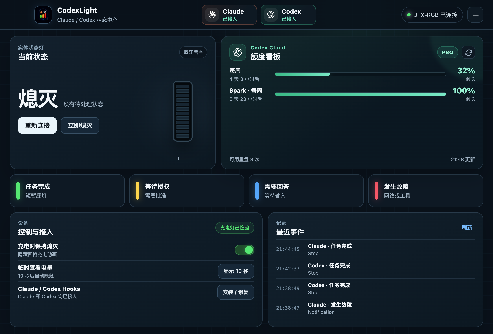

# CodeLight

`JTX-RGB / Colorful Lights` 的 AI 编程 Agent 状态灯桌面端，支持 macOS 和 Windows。

控制台采用固定单页布局，不需要滚动；顶部是可配置的置顶 Agent 区（默认 Claude、Codex），其余工具折叠为数量入口，并提供 Claude、Codex 及其他 Provider 的可切换看板。



## 状态逻辑

| 颜色 | 含义 | 行为 |
|---|---|---|
| 绿色 | 当前任务/回合完成 | 爆闪 6 次，常亮 60 秒；新的完成会重新爆闪并刷新计时 |
| 黄色 | 任一 Agent 网络重试，需要检查或切换网络 | 爆闪后常亮，网络恢复后熄灭 |
| 蓝色 | Agent 等待回答、选择、审批、授权或补充信息 | 爆闪后常亮，处理后熄灭 |
| 红色 | 最终任务、模型/API、认证或额度故障 | 爆闪后常亮，恢复活动或提交新消息后熄灭 |

多个任务同时存在时使用 `红 > 黄 > 蓝 > 绿` 的优先级，同级事件以最新事件优先。默认持续 60 秒，也可设置 10/30/120/300 秒或一直亮到手动处理；新事件会立即抢占并重新计时。正常处理中和没有待处理状态时灯保持熄灭。

首页的每张实体灯卡片都带有软件下拉框，直接显示并修改 `状态灯 → Provider` 映射。“一一绑定”会按置顶顺序将 Claude、Codex、OpenCode 等分别分配给第 1、2、3 盏灯；也可在各自卡片中单独调整任意一盏灯。

## Provider、通知与多设备

CodeLight 内置 Claude、Codex、OpenCode、MiMo Code、Zed Code、Hermes、Kilo/KCode、Gemini CLI、Amp、Cursor、Cline、Roo Code、Aider、Goose、Continue、Qwen Code、Trae、Windsurf 等 Provider。设置页可继续添加任意 Provider，无需修改核心代码。

每个 Provider 可配置名称、图标、启用状态、是否置顶首页及通知点击后打开的软件路径。内置 Provider 已打包各自的品牌图标；自定义 Provider 没有图标时自动使用名称首字母。状态变化会同步发送桌面通知，并显示工具与项目名称；点击通知直接回到对应软件。

可管理任意数量的 JTX-RGB。每盏灯可绑定一个 Provider 或作为共享灯，拥有独立状态队列、优先级和倒计时，互不打断。首页会自适应显示 1–8 个设备卡片；超过 8 盏时显示“更多实体灯”入口，完整设备列表在设置页内独立滚动，不会让主页面滚动。

## 充电显示

控制台中的 **充电时保持熄灭** 默认开启。空闲时发送 App 没有开放的零亮度值，并约每 0.6 秒低频重申一次；这样不需要高频开关灯，也不会人为制造闪烁，不影响充电本身。

点击 **显示 10 秒** 会临时停止压制，让固件原本的电量动画出现，10 秒后自动恢复隐藏。

这属于 BLE 运行时覆盖，不是不可逆刷机。设备断开蓝牙或后台服务退出后，原厂固件逻辑仍然存在。真实固件改造路径见上级目录的 `FIRMWARE.md`。

## 本地开发

```bash
cd desktop-app
npm install
npm run check
npm start
```

macOS 使用上级目录中的 Swift CoreBluetooth 后台服务；Windows 使用 Electron Web Bluetooth 直接连接 `FFF0/FFF3`。

## Claude / Codex 额度与 Agent 看板

macOS 版通过本机 Codex CLI 的 `app-server` RPC 读取 `account/rateLimits/read`，显示主额度、Spark 额度、重置时间和可用重置次数。Claude 看板使用 Claude Desktop 的本机登录会话读取官方实时额度，显示 5 小时、每周以及 Fable 5 等服务端专项额度；实时接口暂时不可用时回退到 Claude 官方客户端的本地额度历史。其他 Provider 同样提供通用实时状态看板。结果缓存 5 分钟，也可在看板右上角手动刷新；登录凭据只在主进程内存中短暂使用，不会传入渲染进程或写入日志。

Codex 数据源与字段映射参考了 [CodexBar](https://github.com/steipete/CodexBar) 的实现。

## 构建

```bash
# Apple Silicon macOS
../build_daemon.sh ../.build/agent-light-daemon
npm run build:mac

# Windows（在 Windows runner 上）
npm run build:win
```

产物位于 `dist/`。GitHub Actions 工作流会同时生成 macOS DMG/ZIP 和 Windows 安装版/便携版。

## 首次使用

1. 给应用蓝牙权限。
2. macOS 点击 **安装适配器**，安装 BLE、Codex 故障监听 LaunchAgent 和工具 Hooks；当前绑定设备来自 `device.id`。
3. Windows 点击 **连接蓝牙设备**，在 CodeLight 页面内搜索并选择 `JTX-RGB`（兼容 `jtx-rgb` 等大小写形式），再点击 **安装适配器** 写入 AI 工具适配器。
4. 点击四张颜色卡进行手动验证。

需要把同一盏灯从 Mac 交给 Windows（或反向交接）时，请在“蓝牙灯”页面点击 **释放蓝牙**。CodeLight 会停止该设备后台，同时保留名称与 Provider 绑定。由于这批 JTX-RGB 固件在连接释放后不会立即重新广播，请再长按背面的 **POWER** 约 2 秒关机、然后长按约 2 秒开机（短按只显示电量）；另一台电脑随后即可搜索。回到原电脑时点击 **重新连接** 即可。

macOS 的手动搜索结果会优先显示未绑定设备，已连接设备标记为“已绑定”并禁止重复选择。首次连接等待窗口为 28 秒，以覆盖 CoreBluetooth 连接、FFF0/FFF3 服务发现与固件初始化时间。

全新 Windows 上连接设备时，CodeLight 会检测本机 Claude/Codex 配置并自动选择对应 Provider，同时自动安装事件适配器。连接多盏同名灯时，未检测到唯一工具的设备按 **Claude → Codex → 其他已启用 Provider** 的顺序一一分配，不会全部落到共享灯；首页和设备页仍可随时调整。

macOS 与 Windows 安装版都会登录自启到后台/托盘，以便 Hooks、通知和 BLE 连接持续可用；主窗口可以随时隐藏。

Claude 桌面版的本地 Agent/Cowork 任务会使用 Claude Code 的用户 hooks，因而受状态灯监控；不启动本地 Agent 的普通聊天页没有工具生命周期事件。

## 复用的开源项目

生命周期 Hook 接入复用了本机已安装的 [Ping Island](https://github.com/erha19/ping-island) relay 和 session 事件模型，没有重复监听 Claude/Codex 进程。JTX-RGB 的 BLE 帧、充电显示覆盖和跨平台控制端是本项目针对实机补充的实现。
